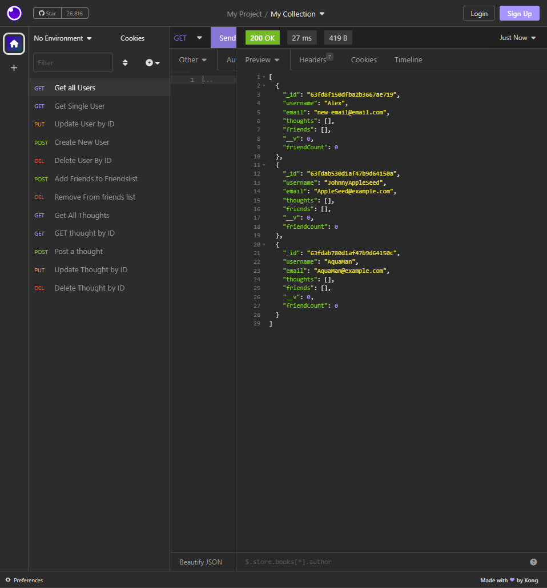

# Social-Network-API

## Description
        
A social network api that runs in the terminal. Users can add and delete friends and create accounts.
 
## Table of Contents
- [Installation](#installation-installation)
- [Usage](#usage-usage)
- [License](#license-license)
- [Contributing](#contributing-contributing)
- [Tests](#tests-tests)
- [Questions](#questions-questions)
        
## Installation {#installation}
        
1. Clone the repo 2.do a npm install 3.npm start

## Usage {#usage}
        
Visted urls to navigate api.
        
## License {#license}
        
None
        
## Contributing {#contributing}
        
None Please dont contribute
        
## Tests {#tests}
        
Inosmnia
        
## Questions {#questions}
If you have any questions, please feel free to contact me at Alex.horning.54@gmail.com 
or check out my GitHub profile at [Makeitouthill](https://github.com/Makeitouthill).